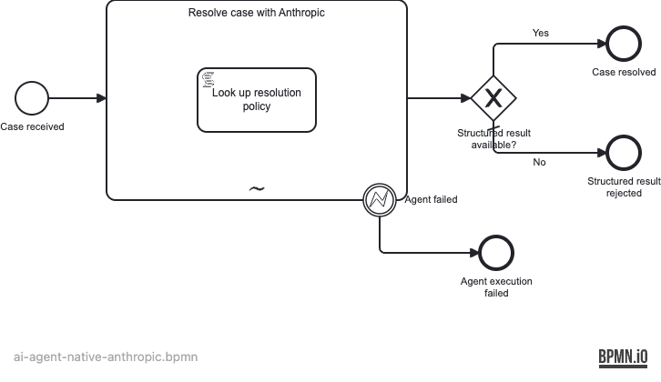

# Native Anthropic case-resolution agent

This runnable Camunda 8.10 example resolves one customer case with an AI Agent Sub-process backed by the native Anthropic Messages API. The agent must call a deterministic BPMN script tool to look up the applicable policy, then return a structured recommendation.

> [!IMPORTANT]
> This example is prepared against released Camunda `8.10.0-alpha5` artifacts. It must not merge until the pin in [`test/pom.xml`](test/pom.xml) is promoted to Camunda 8.10 GA and every gate in [GA promotion](#ga-promotion) passes again.



## What the model demonstrates

- AI Agent Sub-process v2 (`io.camunda.connectors.agenticai.ai-agent-subprocess.v2`)
- native Anthropic provider with the direct Anthropic API backend
- an overridable API endpoint through `{{secrets.ANTHROPIC_API_ENDPOINT}}`
- authentication through `{{secrets.ANTHROPIC_API_KEY}}`, with no credential in source
- adaptive thinking, summarized display, and high effort
- Anthropic automatic prompt caching
- a four-call model limit
- returned agent context and usage metrics
- text-to-JSON parsing plus a BPMN gateway that rejects missing structured output
- a deterministic `LookupResolutionPolicy` script tool whose parameters are declared with `fromAi()`

The long, reusable prompt prefix is the `policyContext` value in [`demo-input.json`](demo-input.json), not a large literal hidden in the BPMN. Reusing that prefix across the agent's model calls makes cache behavior intentional while keeping the model readable.

## Evidence boundaries

| Evidence | Proves | Does not prove |
|---|---|---|
| JSON Camunda Process Test | BPMN orchestration, ad-hoc tool activation, tool completion, structured-result routing, and failure paths | Anthropic's HTTP contract or a live model's behavior |
| Managed Connector Runtime + WireMock test | `/v1/messages` requests, authentication, reasoning and cache fields, tool-result round trip, final response parsing, and usage mapping | Availability or behavior of Anthropic's live service |
| Opt-in live run | The selected model accepts the combined configuration and completes against Anthropic | Deterministic repeatability or production readiness |

The tests never contact Anthropic and need no Anthropic credential.

## Run the credential-free tests

Prerequisites are Java 21, Maven, and a Docker-compatible container runtime.

```bash
mvn test --no-transfer-progress -f examples/ai-agent-native-anthropic/test/pom.xml
```

The run produces a browsable process coverage report at:

```text
examples/ai-agent-native-anthropic/test/target/coverage-report/report.html
```

## Validate and deploy

The following commands use the explicit local profile from the prepared environment. Replace `agentic-dev` only when you intentionally target another cluster.

```bash
npx bpmnlint --config .bpmnlintrc \
  examples/ai-agent-native-anthropic/models/ai-agent-native-anthropic.bpmn

c8ctl deploy examples/ai-agent-native-anthropic/models \
  --profile=agentic-dev
```

The BPMN expects these Connector Runtime secrets:

| Secret | Live value | Test value |
|---|---|---|
| `ANTHROPIC_API_KEY` | Environment-provided Anthropic API key | Non-secret WireMock placeholder |
| `ANTHROPIC_API_ENDPOINT` | `https://api.anthropic.com` | WireMock URL exposed to the managed runtime |

Configure secrets in the Connector Runtime environment before starting it. Do not put values in this repository, command history, screenshots, or logs.

## Opt-in live verification

The live path is intentionally separate from the default tests. Confirm the environment variable exists without printing it, deploy the checked-in BPMN, then await the same checked-in input:

```bash
test -n "${ANTHROPIC_API_KEY:-}" || {
  echo "ANTHROPIC_API_KEY is not set; live verification is blocked."
  exit 1
}

c8ctl deploy examples/ai-agent-native-anthropic/models \
  --profile=agentic-dev

c8ctl await pi \
  --id=ai-agent-native-anthropic \
  --variables=@examples/ai-agent-native-anthropic/demo-input.json \
  --fetchVariables \
  --requestTimeout=180000 \
  --profile=agentic-dev
```

The running Connector Runtime must have `ANTHROPIC_API_KEY` and `ANTHROPIC_API_ENDPOINT` available as secrets; exporting them only in the c8ctl shell does not inject them into an already-running runtime.

On success, inspect:

- `agent.responseJson` for `outcome`, `priority`, `recommendation`, and `rationale`
- `agent.context.metrics` for model-call and usage data
- the completed `LookupResolutionPolicy` activity in Operate or through the Camunda APIs

Prompt caching is **configured** by the BPMN. Claim an observed cache hit only if the live response metrics contain provider-reported cache usage. If they do not, record “configured, not observed.”

### Live failure handling

- **Missing credential:** stop before deployment and configure the Connector Runtime secret.
- **401:** verify the secret at the runtime boundary; never print it.
- **429:** respect the provider's retry guidance and retry later; do not weaken the model-call limit.
- **Unsupported model settings:** stop the live acceptance run and revise the configuration only after a combined capability probe.
- **Malformed final text:** the connector leaves `responseJson` empty and BPMN ends at **Structured result rejected**, not **Case resolved**.
- **Await timeout:** recover the instance through `c8ctl search pi --profile=agentic-dev`; `await` does not return an instance key after an HTTP timeout.

## Configuration rationale

`claude-sonnet-4-6` is provisional for the live tutorial because released `8.10.0-alpha5` connector tests exercise that model identifier with effort, adaptive thinking, prompt caching, and tool use. A real provider credential is still required to prove that exact combination against Anthropic before recording or publication.

The direct API endpoint remains a secret-backed override because the same BPMN must target `https://api.anthropic.com` live and a local WireMock endpoint in deterministic tests. Authentication is always secret-backed, including the non-secret test placeholder.

The tool is a FEEL script task, so the default process has no hidden API dependency. This example recommends an action; it does not issue refunds, change accounts, or contact customers.

## GA promotion

Before this example can merge:

1. Replace the single `${camunda.version}` alpha5 pin in [`test/pom.xml`](test/pom.xml) with Camunda 8.10 GA.
2. Confirm the released GA v2 template preserves every configured mapping in the BPMN.
3. Run the full Maven suite, BPMN lint, metadata validation, secret scan, and deployment smoke test.
4. Repeat the opt-in combined Anthropic capability probe and live run on the final commit.
5. Record observed cache/reasoning evidence honestly and link the implementation PR to [camunda/camunda-8-tutorials#123](https://github.com/camunda/camunda-8-tutorials/issues/123).

## Educational scope

This example uses synthetic data and is not production guidance. A production design must add domain-specific authorization, privacy controls, model evaluation, cost monitoring, retries, incident ownership, prompt-injection defenses, and human review appropriate to the risk.
