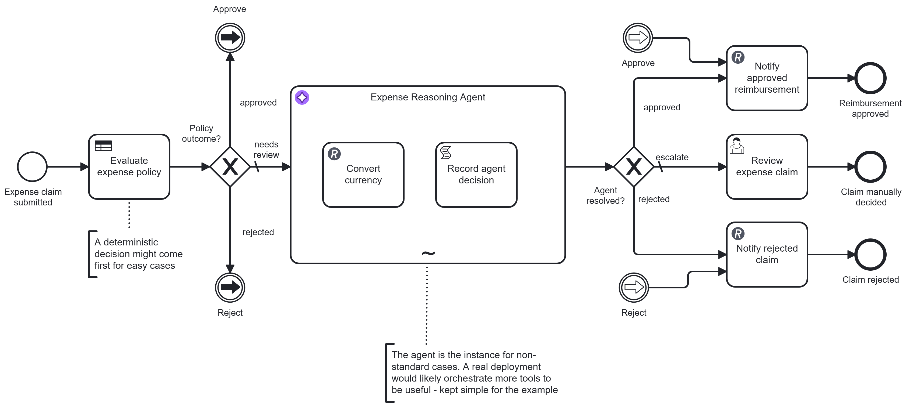

# Expense Decision Agent

[](https://modeler.cloud.camunda.io/import/resources?source=https://raw.githubusercontent.com/camunda/camunda-8-tutorials/main/examples/decision-agent/models/expense-decision-agent.bpmn,https://raw.githubusercontent.com/camunda/camunda-8-tutorials/main/examples/decision-agent/models/expense-policy.dmn,https://raw.githubusercontent.com/camunda/camunda-8-tutorials/main/examples/decision-agent/models/expense-claim-start.form,https://raw.githubusercontent.com/camunda/camunda-8-tutorials/main/examples/decision-agent/models/expense-claim-review.form&title=Expense%20Decision%20Agent)

A concrete runnable **Decision Agent** example based on the pattern at [camunda.com/orchestrate/agents](https://camunda.com/orchestrate/agents/).



It contains:

- a DMN business rule table that auto-approves or auto-rejects the predictable, clear-cut cases deterministically - the agent is never invoked for these
- an agent subprocess with a real tool call, invoked only for the gray-zone cases the rule table flags as needs-review
- a documented policy exception the agent applies with judgment, something a static rule table can't express
- deterministic aggregation and routing after either the rule table or the agent reaches a verdict, with human handoff for anything genuinely ambiguous

It is intentionally compact so you can import, run, and inspect quickly.

## Try it in 5 minutes (Camunda 8 SaaS - recommended)

The smoothest path is to use a trial cluster in Camunda SaaS. Just use the following button and install the example into your cluster - you can signup on the way if you don't yet have one:

[](https://modeler.cloud.camunda.io/import/resources?source=https://raw.githubusercontent.com/camunda/camunda-8-tutorials/main/examples/decision-agent/models/expense-decision-agent.bpmn,https://raw.githubusercontent.com/camunda/camunda-8-tutorials/main/examples/decision-agent/models/expense-policy.dmn,https://raw.githubusercontent.com/camunda/camunda-8-tutorials/main/examples/decision-agent/models/expense-claim-start.form,https://raw.githubusercontent.com/camunda/camunda-8-tutorials/main/examples/decision-agent/models/expense-claim-review.form&title=Expense%20Decision%20Agent)

Why SaaS first:

- Preconfigured to use the [Camunda-provided LLM](https://docs.camunda.io/docs/components/agentic-orchestration/camunda-provided-llm/), so no access tokens, secrets, or external API keys needed
- No local installation required

1. Click the button above to import the process, the DMN table, and both forms into Camunda SaaS as one project.
2. Open **expense-decision-agent** and click **Deploy and Run**. Its start form opens, already filled in with a clear-cut, auto-approved claim - submit it as-is, or replace the values with one of the other scenarios listed on the form (or below).

   (Starting via API/`zbctl`/Desktop Modeler instead of the form works the same way - just supply the fields directly, e.g. the "gray zone, agent resolves" sample:
   ```json
   {
     "category": "meals",
     "amount": 90,
     "currency": "EUR",
     "justification": "Dinner with a prospective client to close a deal; four attendees, itemized receipt attached."
   }
   ```
   )
3. Watch the flow in Operate: `Evaluate expense policy` runs the DMN table first. For the two clear-cut scenarios, a gateway routes straight to a notification and the agent subprocess never starts. For the gray-zone scenarios, the `Expense Reasoning Agent` subprocess starts, calls a real currency-conversion API when the claim isn't in USD, and records its own recommendation.
4. If the agent couldn't confidently resolve the claim, complete the **Review expense claim** task in Tasklist to finish the process.

## What happens technically

`Evaluate expense policy` is a DMN business rule task, not a model call - it decides the common, predictable cases (known category, USD, amount clearly inside or outside the approve/reject bands) instantly and for free. Only the cases it can't resolve on their own - a gray-zone amount, a non-USD claim, or a category the table doesn't cover - reach the agent at all.

| # | Capability | Protocol | Public service used | Tool / BPMN element |
|---|---|---|---|---|
| 1 | Convert currency | REST | [frankfurter.dev](https://frankfurter.dev) (ECB reference exchange rates) | `ConvertCurrency` |

That's the one real tool the agent has, and it's only useful for exactly the cases the policy engine couldn't handle: turning a non-USD amount into something comparable against the same USD policy bands. Governed by Camunda like any connector call: retried automatically on failure, fully visible and audited in Operate, and constrained to exactly what's modeled in the ad-hoc sub-process.

After `Evaluate expense policy`:

- `Policy outcome?` gateway sends `approved`/`rejected` straight to a notification
- `needs review` (the default path) hands off to the `Expense Reasoning Agent`

Inside the agent subprocess, the model is told the same policy bands the rule table just used, plus one documented exception it's allowed to apply with judgment: a `meals` claim can go up to double its normal cap if the justification clearly describes client or prospect entertainment with multiple attendees and a receipt - something a flat DMN band can't express, but a paragraph of context can. The agent converts currency if needed, then records `approved`, `rejected`, or `escalate`.

- `Agent resolved?` gateway sends `approved`/`rejected` to the same two notification tasks the policy gateway uses
- `escalate` (the default path) creates the user task `Review expense claim`

The key point: the rule table isn't a fallback for when the agent is unavailable - it's the first-class decision-maker for the cases that don't need reasoning at all. The agent is scoped to exactly the residual the rules can't cover.

## Demo scenarios

The start form ships filled in with the first scenario below. To try the others, replace the four field values with one of these sets (also listed directly on the form) before submitting - no BPMN or DMN changes needed.

### Clear approve (policy decides, agent never runs)

`category: meals, amount: 45, currency: USD`

`Team lunch with three colleagues; standard restaurant receipt attached.`

Inside the $75 meals cap in USD - the DMN table approves it directly.

### Clear reject (policy decides, agent never runs)

`category: lodging, amount: 550, currency: USD`

`Presidential suite booked for a one-night conference stay.`

Well above the $400 lodging cap in USD - the DMN table rejects it directly.

### Gray zone, agent resolves (foreign currency + documented exception)

`category: meals, amount: 90, currency: EUR`

`Dinner with a prospective client to close a deal; four attendees, itemized receipt attached.`

Non-USD, so the DMN table can't judge it against the USD bands and flags `needs-review`. The agent calls `ConvertCurrency` (90 EUR -> ~97 USD), recognizes the client-entertainment exception applies given the justification, and approves it - within the doubled $150 cap.

### Gray zone, agent escalates (genuinely ambiguous)

`category: lodging, amount: 320, currency: USD`

`Hotel for an extended stay; exact reason unclear, awaiting further details from the employee.`

Already in USD but between the $250 approve and $400 reject bands for lodging, so the DMN table flags `needs-review`. The justification gives the agent nothing concrete to reason from, so it escalates rather than guessing - and a human decides in Tasklist.

## Local/self-managed path (advanced)

Use this only if you need local Docker-based setup with your own LLM.

1. [Install a local LLM](https://docs.camunda.io/docs/next/guides/getting-started-agentic-orchestration/#set-up-ollama) (or use hosted credentials).
2. Configure environment variables (example for local Ollama):

```env
SECRET_CAMUNDA_PROVIDED_LLM_API_ENDPOINT=http://localhost:11434/v1
SECRET_CAMUNDA_PROVIDED_LLM_API_KEY=null
SECRET_CAMUNDA_PROVIDED_LLM_DEFAULT_MODEL=gpt-oss:20b
```

3. Start [Camunda 8 Run](https://docs.camunda.io/docs/self-managed/quickstart/developer-quickstart/c8run/).
4. Deploy all four files in [models/](models/): `expense-decision-agent.bpmn`, `expense-policy.dmn`, `expense-claim-start.form`, and `expense-claim-review.form`.
5. Start an instance via Tasklist's form (the default values give you the "clear approve" scenario) or with the same sample variables shown above.

Camunda secrets read `secrets.<NAME>` from same-named environment variables.

## Optional: see live notifications

By default, both `Notify approved reimbursement` and `Notify rejected claim` post to `https://httpbin.io/post` (echo response only).

For a live demo:

1. Create a unique URL at [webhook.site](https://webhook.site/).
2. Replace the `url` input in either notification task.
3. Start a new instance and observe incoming requests in webhook.site.

## Notes and disclaimer

This is an illustrative demo only.

- Public services are stand-ins for real enterprise systems (payroll/finance notification channels, a real exchange-rate provider).
- No real employee, payroll, or financial account data is used.
- Nothing here should be interpreted as financial, tax, or expense-policy guidance.
- Exchange rates from frankfurter.dev are real ECB reference rates and will vary from the numbers quoted above depending on the day you run this.

Please be respectful of shared public services. This example is intentionally low-volume and not intended for load testing.
