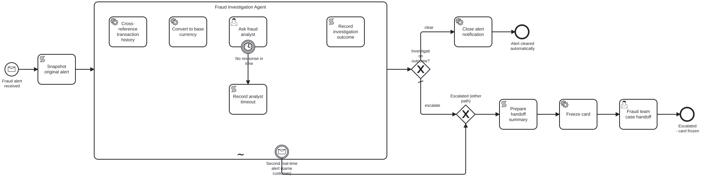

# Fraud Alert Triage Agent (Event-Driven Agent)

[](https://modeler.cloud.camunda.io/import/resources?source=https://raw.githubusercontent.com/camunda/camunda-8-tutorials/main/examples/event-driven-agent/models/fraud-alert-triage-agent.bpmn,https://raw.githubusercontent.com/camunda/camunda-8-tutorials/main/examples/event-driven-agent/models/fraud-analyst-consult.form,https://raw.githubusercontent.com/camunda/camunda-8-tutorials/main/examples/event-driven-agent/models/fraud-team-handoff.form&title=Event-Driven%20Agent)

A concrete runnable **Event-Driven Agent** example based on the pattern at [camunda.com/orchestrate/agents](https://camunda.com/orchestrate/agents/):

> Wakes up when something happens. Triggered by an event: a payment threshold breached, a document received, a timer fired, an external system signaling a state change. The agent resumes, reasons over the new context, and acts. No polling, no scheduled jobs. BPMN message, timer, and signal events are first-class constructs.



It contains:

- a process with **no start form at all** - the only way in is an inbound webhook, so the process simply does not exist until an external system posts to it
- **one webhook endpoint, reused for every alert on the same customer** - a message start event with a required correlation key means a first alert starts a case, and a later alert for the same customer correlates straight into the running case instead. This is native Zeebe message correlation, not custom "check if already running" logic bolted on top
- an interrupting message boundary event on the agent, subscribed to that same correlation - it can cancel the agent at any point, including while it is waiting on a human task, whenever a second real-time alert for that customer arrives
- a human consultation that lives *inside* the agent's own tool loop - the agent decides for itself whether a case is ambiguous enough to ask a fraud analyst, and it keeps the final call either way. Contrast this with this repo's [Human-in-the-Loop Agent](../human-in-the-loop-agent) example, where the human gate is structurally mandatory; here it is the agent's own judgment
- a timer boundary event bounding how long the agent will wait for that analyst - a demo-scale SLA, and the third first-class event type (message, message, timer) this example exercises

It is intentionally compact so you can import, run, and interrupt quickly.

## Try it in 5 minutes (Camunda 8 SaaS - recommended)

The smoothest path is to use a trial cluster in Camunda SaaS. Just use the following button and install the example into your cluster - you can sign up on the way if you don't yet have one:

[](https://modeler.cloud.camunda.io/import/resources?source=https://raw.githubusercontent.com/camunda/camunda-8-tutorials/main/examples/event-driven-agent/models/fraud-alert-triage-agent.bpmn,https://raw.githubusercontent.com/camunda/camunda-8-tutorials/main/examples/event-driven-agent/models/fraud-analyst-consult.form,https://raw.githubusercontent.com/camunda/camunda-8-tutorials/main/examples/event-driven-agent/models/fraud-team-handoff.form&title=Event-Driven%20Agent)

Why SaaS first:

- Preconfigured to use the [Camunda-provided LLM](https://docs.camunda.io/docs/components/agentic-orchestration/camunda-provided-llm/), so no access tokens, secrets, or external API keys needed
- The [Webhook connector](https://docs.camunda.io/docs/components/connectors/protocol/http-webhook/) is built in - deploying the process is enough to get a real, public HTTPS endpoint, with nothing else to install or configure

1. Click the button above to import the process and both forms into Camunda SaaS as one project.
2. Open **fraud-alert-triage-agent** and click **Deploy** (not "Deploy and run" - there's no start form to open, since this process only starts from a webhook).
3. Click the **Fraud alert received** start event, open the **Webhooks** tab in the properties panel, and copy its URL. It looks like `https://<region>.connectors.camunda.io/<cluster-id>/inbound/fraud-alert-received`. This is the **only** webhook URL in this example - you'll reuse it for every alert.
4. Fire the first alert - this is the "ambiguous" scenario, the one most likely to make the agent invoke its own analyst-consult tool (see [Demo scenarios](#demo-scenarios) for the others):

   ```bash
   curl -X POST "<the URL you copied>" \
     -H "Content-Type: application/json" \
     -d '{
       "alertId": "ALERT-6602",
       "customerId": "CUST-40101",
       "cardLast4": "7788",
       "transactionAmount": 2200.00,
       "transactionCurrency": "USD",
       "merchantName": "Sunset Auto Parts",
       "merchantCountry": "United States",
       "riskScore": 52,
       "alertReason": "Slightly elevated amount for a returning merchant category; one related alert in the past quarter that was previously dismissed as a false positive."
     }'
   ```

5. Watch the flow in Operate: a process instance appears the moment the webhook lands, and the `Fraud Investigation Agent` subprocess starts reasoning immediately - no polling, nothing waiting for the next cron tick.
6. If the agent decides to consult a human, an **Ask fraud analyst** task appears in Tasklist within its own attempt. Answer it (or leave it - it times out automatically after 2 minutes and the agent proceeds without it) and the agent records its final outcome. Depending on what happens, the case either closes automatically or reaches **Fraud team case handoff** in Tasklist.

## Try the interrupt (the actual point of this example)

Steps 1-3 above are the same - same URL, no second endpoint. This time you'll call it **twice** for the same customer, which is exactly how the real system would behave: it doesn't know or care whether this is a first alert or a follow-up, it just posts every alert it has to the same place.

1. Fire the first alert - on paper it looks mundane, and left alone the agent would very likely clear it automatically in a few seconds:

   ```bash
   curl -X POST "<your webhook URL>" \
     -H "Content-Type: application/json" \
     -d '{
       "alertId": "ALERT-6604",
       "customerId": "CUST-40112",
       "cardLast4": "3315",
       "transactionAmount": 4800,
       "transactionCurrency": "NOK",
       "merchantName": "Alpine Ski Rentals Oslo",
       "merchantCountry": "Norway",
       "riskScore": 45,
       "alertReason": "Slightly above average ski-season purchase; first time renting from this merchant."
     }'
   ```

2. **Immediately** - within about 8 seconds, while `Cross-reference transaction history` is still running - fire a **second** alert with the **same `customerId`**, describing a classic card-testing / impossible-travel pattern:

   ```bash
   curl -X POST "<your webhook URL>" \
     -H "Content-Type: application/json" \
     -d '{
       "alertId": "ALERT-6605",
       "customerId": "CUST-40112",
       "cardLast4": "3315",
       "transactionAmount": 1.00,
       "transactionCurrency": "USD",
       "merchantName": "QuickMart Convenience #4471",
       "merchantCountry": "Philippines",
       "riskScore": 81,
       "alertReason": "Second authorization attempt on this card within seconds - different country and merchant category from the first alert. Classic card-testing / impossible-travel pattern."
     }'
   ```

3. Watch Operate: the **second** call does not create a second process instance. Because both calls share the same `customerId` correlation key, and an instance for that key is already running, Zeebe correlates the second message into the already-open subscription on the agent's interrupting boundary event instead of starting a new case. The agent subprocess is cancelled mid-flight - you'll see it end via the interrupting boundary event, not a normal completion - and the token jumps straight to `Freeze card`, then **Fraud team case handoff** in Tasklist. The agent never gets to finish its first investigation, and nothing about its own reasoning had any say in the outcome.

   > **First time trying this:** confirm in Operate that step 2 really did correlate into the *existing* instance rather than spin up a second one. This relies on Zeebe's general message-correlation semantics (an open subscription on a running instance wins over starting a new one) rather than a special case Camunda has published a dedicated test for - it should behave exactly like the equivalent, Camunda-validated pattern for event subprocesses, but it's worth seeing it happen once with your own eyes.

If you're not fast enough and the agent finishes on its own first, that's fine - just start a fresh instance (a new `customerId`) and try again. The 8-second delay is deliberate and documented on the `Cross-reference transaction history` tool, precisely so this is reproducible instead of a lucky race.

## What happens technically

There is no start form. **Fraud alert received** is the [Webhook connector](https://docs.camunda.io/docs/components/connectors/protocol/http-webhook/), applied to a *message* start event rather than a plain one, with a required correlation key (`customerId`). The entire incoming JSON body becomes process variables. A `Snapshot original alert` step immediately copies those into separate `original*` variables, so that if a later alert overwrites the plain ones, the handoff task can still show what was originally under investigation alongside whatever triggered the escalation.

Inside `Fraud Investigation Agent`, the model can invoke:

| # | Capability | Protocol | Backing service | Tool / BPMN element |
|---|---|---|---|---|
| 1 | Cross-reference history | REST (deliberately slow) | [httpbin.io](https://httpbin.io) `/delay/8` | `CrossReferenceTransactionHistory` |
| 2 | Convert currency | REST | [frankfurter.app](https://frankfurter.app) (ECB reference rates) | `ConvertToBaseCurrency` |
| 3 | Ask a human analyst | Human task, agent's own choice | Tasklist, form `fraud-analyst-consult` | `AskFraudAnalyst` (2-minute timer boundary) |

The agent's policy: always cross-reference first, convert to USD if needed, then apply two hard thresholds - clearly clear (no related alerts, risk score under 40, USD amount under 1,000) or clearly escalate (2+ related alerts, or risk score 70+, or USD amount 5,000+). Anything in between is genuinely ambiguous, and the agent may - entirely its own call - invoke `AskFraudAnalyst` for a second opinion before deciding. If nobody answers within the attached timer (2 minutes here, standing in for a real SLA), the boundary event fires, the agent is told so, and it proceeds on its own judgment. Either way, the agent alone records the final `clear`/`escalate` outcome - the analyst is advisory, never a gate.

The event-driven part is the **Second real-time alert** boundary event on the whole agent subprocess: a bare interrupting message boundary event, no connector, no separate URL, subscribed to the exact same message (name + `customerId` correlation key) as the start event. This is what the marketing page means by "BPMN message... events are first-class constructs": there's no polling loop checking "has anything new come in for this customer?", no flag the agent has to check between tool calls or during a human wait. Zeebe simply cancels the ad-hoc subprocess - and anything running inside it, including a pending `AskFraudAnalyst` task - the moment a second alert for that customer correlates, wherever the case happened to be. The agent's system prompt even says so explicitly: *"there is nothing special for you to do about it"* - the guarantee is structural, not something the model has to cooperate with.

Both ways a case can reach the fraud team - the agent escalating on its own (possibly after consulting the analyst), or the interrupt firing - flow through a plain merging gateway (`Escalated (either path)`) into `Prepare handoff summary`, which builds one consistent explanation using whichever variables are actually set, before `Freeze card` and the human handoff.

## Demo scenarios

All scenarios are fired the same way - `curl` against the one **Fraud alert received** webhook URL. None of them need a form.

### Clearly cleared automatically

```json
{
  "alertId": "ALERT-6601",
  "customerId": "CUST-40100",
  "cardLast4": "2210",
  "transactionAmount": 145.50,
  "transactionCurrency": "USD",
  "merchantName": "Riverside Coffee Roasters",
  "merchantCountry": "United States",
  "riskScore": 38,
  "alertReason": "New merchant category for this customer, amount is modest relative to typical spend."
}
```

`CUST-40100` → 0 related alerts, risk score 38, $145.50 - clears every "clearly low risk" threshold, so the agent clears it directly. Nothing reaches a human.

### Clearly escalated

```json
{
  "alertId": "ALERT-6603",
  "customerId": "CUST-40103",
  "cardLast4": "7788",
  "transactionAmount": 2450.00,
  "transactionCurrency": "USD",
  "merchantName": "Nordic Electronics Oslo",
  "merchantCountry": "Norway",
  "riskScore": 62,
  "alertReason": "First-time merchant category and country for this customer, amount well above their typical transaction size."
}
```

`CUST-40103` → 3 related alerts (`40103 mod 4 = 3`) alone clears the "clearly high risk" bar, so the agent escalates directly - no analyst consultation needed, straight to `Freeze card` and Tasklist.

### Ambiguous - the agent may ask the analyst (see [above](#try-it-in-5-minutes-camunda-8-saas---recommended))

`CUST-40101` → 1 related alert, risk score 52, $2,200 - lands in neither bucket. Whether the agent actually calls `AskFraudAnalyst` here is genuinely up to the model; try it a few times and you may see it decide either way.

### Interrupted mid-investigation (see [above](#try-the-interrupt-the-actual-point-of-this-example))

First alert `CUST-40112` → 0 related alerts, risk score 45, ~$495 after NOK conversion - on its own, on track to resolve calmly. A second alert for the same `customerId`, describing a rapid-fire, different-country, different-merchant, $1 test charge, overrides that outcome completely regardless of how the first investigation would have ended.

The `relatedAlerts90d` figure is computed deterministically from the digits in `customerId` (`modulo(number(substring(customerId, 6)), 4)`) rather than pulled from a real database, so every run of a given scenario behaves the same way.

## Local/self-managed path (advanced)

Use this only if you need local Docker-based setup with your own LLM. The webhook mechanics work the same way, but you'll need to construct the URL yourself (no **Webhooks** tab in Desktop Modeler):

`http(s)://<connectors base URL>/inbound/fraud-alert-received` - see the [HTTP Webhook connector docs](https://docs.camunda.io/docs/components/connectors/protocol/http-webhook/#activate-the-http-webhook-connector-by-deploying-your-diagram) for the exact base URL for your setup.

1. [Install a local LLM](https://docs.camunda.io/docs/next/guides/getting-started-agentic-orchestration/#set-up-ollama) (or use hosted credentials).
2. Configure environment variables (example for local Ollama):

```env
SECRET_CAMUNDA_PROVIDED_LLM_API_ENDPOINT=http://localhost:11434/v1
SECRET_CAMUNDA_PROVIDED_LLM_API_KEY=null
SECRET_CAMUNDA_PROVIDED_LLM_DEFAULT_MODEL=gpt-oss:20b
```

3. Start [Camunda 8 Run](https://docs.camunda.io/docs/self-managed/quickstart/developer-quickstart/c8run/).
4. Deploy [models/fraud-alert-triage-agent.bpmn](models/fraud-alert-triage-agent.bpmn), [models/fraud-analyst-consult.form](models/fraud-analyst-consult.form), and [models/fraud-team-handoff.form](models/fraud-team-handoff.form).
5. Trigger it with the same `curl` commands shown above, against your own webhook base URL.

Camunda secrets read `secrets.<NAME>` from same-named environment variables.

## Notes and disclaimer

This is an illustrative demo only, deliberately simplified to make the event-driven mechanics legible in a few minutes.

- **Real fraud investigation is a lot more complex than this.** Production systems weigh dozens of signals (device fingerprinting, behavioral biometrics, network-level velocity checks across merchants and issuers, case history, regulatory constraints on autonomous card actions, and far more), typically layer multiple models and rule engines rather than one LLM call, and involve compliance and legal review this example doesn't attempt to model. The point here is to show *how* Camunda models an event-driven agent - the webhook-only trigger, the shared-endpoint start-or-correlate mechanism, an agent-invoked (not mandatory) human step, and a timer-bounded wait - not to prescribe how fraud detection should actually work.
- Public services are stand-ins for real enterprise systems (a card processor, a case-management platform).
- The 8-second delay on `Cross-reference transaction history` and the 2-minute analyst timeout exist purely so the interrupt and timeout demos are reproducible in a live walkthrough - a real fraud platform wouldn't need to be artificially slowed down, and a real SLA would likely be measured in hours.
- No real customer, card, or transaction data is used.
- Nothing here should be interpreted as fraud-detection or compliance guidance.

Please be respectful of shared public services (httpbin.io, frankfurter.app). This example is intentionally low-volume and not intended for load testing.
