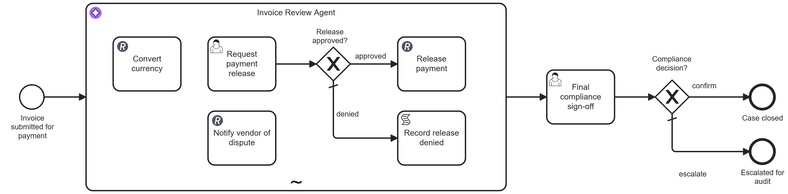

# Invoice Payment Approval Agent

[](https://modeler.cloud.camunda.io/import/resources?source=https://raw.githubusercontent.com/camunda/camunda-8-tutorials/main/examples/human-in-the-loop-agent/models/invoice-payment-agent.bpmn,https://raw.githubusercontent.com/camunda/camunda-8-tutorials/main/examples/human-in-the-loop-agent/models/invoice-submit.form,https://raw.githubusercontent.com/camunda/camunda-8-tutorials/main/examples/human-in-the-loop-agent/models/payment-release-request.form,https://raw.githubusercontent.com/camunda/camunda-8-tutorials/main/examples/human-in-the-loop-agent/models/compliance-signoff.form&title=Human-in-the-Loop%20Agent)

A concrete runnable **Human-in-the-Loop Agent** example based on the pattern at [camunda.com/orchestrate/agents](https://camunda.com/orchestrate/agents/).



It contains **two different flavors of human-in-the-loop in the same process**, deliberately side by side:

- an **in-loop approval gate**: releasing payment is itself one of the agent's tools, and that tool *is* a human user task living inside the agent's own ad-hoc subprocess. The agent never stops reasoning to get this approval - it just makes a tool call that happens to take a human to answer, then carries on with whatever comes back.
- a **classic post-hoc gate**: after the agent is completely done, a second, independent compliance sign-off task sits outside the subprocess - the kind of checkpoint you could bolt onto any agent framework, agentic-BPMN or not.

Plus:

- a real tool call (currency conversion) the agent can use freely, with no human gate at all - not every tool needs one, only the one that moves money
- a structural guarantee, not a prompt instruction: the real payment-release connector has exactly one incoming path in the whole diagram, and it starts at the human task

It is intentionally compact so you can import, run, and inspect quickly.

## Try it in 5 minutes (Camunda 8 SaaS - recommended)

The smoothest path is to use a trial cluster in Camunda SaaS. Just use the following button and install the example into your cluster - you can signup on the way if you don't yet have one:

[](https://modeler.cloud.camunda.io/import/resources?source=https://raw.githubusercontent.com/camunda/camunda-8-tutorials/main/examples/human-in-the-loop-agent/models/invoice-payment-agent.bpmn,https://raw.githubusercontent.com/camunda/camunda-8-tutorials/main/examples/human-in-the-loop-agent/models/invoice-submit.form,https://raw.githubusercontent.com/camunda/camunda-8-tutorials/main/examples/human-in-the-loop-agent/models/payment-release-request.form,https://raw.githubusercontent.com/camunda/camunda-8-tutorials/main/examples/human-in-the-loop-agent/models/compliance-signoff.form&title=Human-in-the-Loop%20Agent)

Why SaaS first:

- Preconfigured to use the [Camunda-provided LLM](https://docs.camunda.io/docs/components/agentic-orchestration/camunda-provided-llm/), so no access tokens, secrets, or external API keys needed
- No local installation required

1. Click the button above to import the process and all three forms into Camunda SaaS as one project.
2. Open **invoice-payment-agent** and click **Deploy and Run**. Its start form opens, already filled in with a clean, matching invoice - submit it as-is, or replace the values with one of the other scenarios listed on the form (or below).

   (Starting via API/`zbctl` instead of the form works the same way - just supply the fields directly, e.g. the "documented adjustment" sample:
   ```json
   {
     "vendorName": "Meridian Logistics",
     "invoiceNumber": "INV-55871",
     "poNumber": "PO-77410",
     "poAmount": 12000,
     "invoiceAmount": 12540,
     "invoiceCurrency": "USD",
     "invoiceNotes": "Includes a $540 expedited freight surcharge, pre-approved by procurement via email on the 3rd."
   }
   ```
   )
3. Watch the flow in Operate: the `Invoice Review Agent` starts immediately, calls a real currency-conversion API when the invoice isn't in USD, and - once it decides to pay - calls its `Request payment release` tool.
4. Complete the **Request payment release** task in Tasklist. This *is* a tool call, not a separate step bolted on afterwards - the agent is waiting on this one specific answer before it can finish. Approve it (or deny it, to see the agent adapt and notify the vendor of a dispute instead).
5. Once the agent finishes, complete the **Final compliance sign-off** task in Tasklist - a second, independent checkpoint that only looks at what happened, not how the agent got there.

## What happens technically

`Invoice Review Agent` is an ad-hoc subprocess (an AI agent) that runs on every invoice submitted - there's no rule table or gateway deciding whether it's needed.

| # | Capability | Protocol | Public service used | Tool / BPMN element |
|---|---|---|---|---|
| 1 | Convert currency | REST | [frankfurter.app](https://frankfurter.app) (ECB reference exchange rates) | `ConvertCurrency` |
| 2 | Release payment (human-gated) | User task + REST | - | `RequestPaymentRelease` -> `ReleasePayment` |
| 3 | Notify vendor of a dispute | REST | - | `NotifyVendorDispute` |

The agent follows a matching policy a real accounts-payable team would use: within 2% of the PO amount is a clean match, an overage up to 10% is fine if the invoice notes give *any* reason, and anything else - an unexplained overage, too large an overage, or an amount below the PO - gets disputed instead of paid. If the invoice isn't in USD, it calls `ConvertCurrency` first so the comparison is apples-to-apples with the PO amount, which is always in USD.

### The in-loop gate: a tool that happens to be a human

`RequestPaymentRelease` is a plain Camunda user task - but it lives *inside* the ad-hoc subprocess with no incoming sequence flow, which is exactly what makes an element a callable tool for the agent (Camunda resolves tools as the subprocess's root nodes - the ones with no incoming flow - regardless of what kind of BPMN element they are). The agent supplies the amount it wants to release and its reasoning via `fromAi()` parameters, exactly like any other tool call. Camunda creates a real Tasklist item; the agent's reasoning simply pauses until a human answers it, then resumes with the result as this tool's return value - no different from waiting on a slow HTTP call.

From that user task, one sequence flow leads to `Gateway_ReleaseApproved`:

- **approve** -> `ReleasePayment`, a real HTTP call. This is the only element in the entire diagram with an incoming path into it - there is no other sequence flow, gateway default, or shortcut that reaches it. If a human never approves a release, this connector never fires.
- **deny** (default) -> `RecordReleaseDenied`, which returns the reviewer's comments to the agent as the tool's result, so it can decide what to do next - typically calling `NotifyVendorDispute` - without exiting the subprocess or losing any context from the conversation so far.

This is the core of the pattern: the *tool itself* is the checkpoint. There's no prompt instruction the model could ignore and no confidence threshold to tune away - `ReleasePayment` is structurally unreachable except through a completed, approved human task, and the agent that requested it is still the same agent that finds out what happened and reacts.

### The post-hoc gate: the same checkpoint any framework could bolt on

Once the agent has either released a payment or decided not to, it stops calling tools and the ad-hoc subprocess completes on its own - no extra "wrap-up" tool call required. What actually happened is derived deterministically, not self-reported: the subprocess's own output mapping sets `caseOutcome` to `released` if `paymentReceipt` exists (i.e. `ReleasePayment` really fired), `disputed` if `disputeNoticeReceipt` exists, or `held` otherwise - straight FEEL over the real facts already sitting in process variables, with no dependency on the model accurately narrating its own actions.

The process then reaches `Final compliance sign-off` - a completely ordinary user task and gateway sitting *outside* the agent, in the classic "wait for a human, then route" shape. It doesn't need the agent's conversation state, memory, or tool-call context - just those derived facts. That's deliberate: this second checkpoint is exactly the kind of post-completion approval step you could implement by bolting a queue and a UI onto any agent loop, agentic-BPMN or not (see [why bolting LangChain onto a workflow engine backfires at scale](https://camunda.com/blog/2026/07/why-bolting-langchain-onto-a-workflow-engine-backfires-at-scale/)). The contrast with the in-loop gate above is the point: one requires the process engine to own the agent's reasoning state to work at all, the other doesn't.

## Demo scenarios

The start form ships filled in with the first scenario below. To try the others, replace the six field values with one of these sets (also listed directly on the form) before submitting - no BPMN changes needed. Every scenario reaches both the in-loop release task and the post-hoc compliance task.

### Clean match

`vendor: Acme Office Supplies, PO: PO-88291 / $4,200, invoice: INV-10234 / $4,200 USD`

`Quarterly office supplies delivery per PO, no changes.`

Invoice matches the PO exactly. The agent calls `RequestPaymentRelease` for $4,200 - approve it in Tasklist to see `ReleasePayment` actually fire, then confirm the case at compliance sign-off.

### Documented adjustment

`vendor: Meridian Logistics, PO: PO-77410 / $12,000, invoice: INV-55871 / $12,540 USD`

`Includes a $540 expedited freight surcharge, pre-approved by procurement via email on the 3rd.`

4.5% over the PO amount, within the 10% band, with a specific, pre-approved reason. Approve the release request for the full $12,540.

### Foreign currency

`vendor: Nordholm Components AB, PO: PO-90112 / $8,000, invoice: INV-2231 / €7,400`

`Standard components delivery per PO, exact quantities.`

Not in USD, so the agent calls `ConvertCurrency` (≈7,400 EUR → ≈8,000 USD) before requesting release. Approve it once it lands in Tasklist.

### Vague justification - deny this one

`vendor: Briarwood Facilities Group, PO: PO-66234 / $5,000, invoice: INV-9987 / $5,350 USD`

`Includes miscellaneous facility charges from the past quarter.`

7% over the PO amount - within the policy's overage band, and there's technically *a* reason in the notes, so the agent will typically still request release for $5,350. This is the scenario built to show the human catching what the agent's simpler policy check would wave through: **deny** the request in Tasklist with a comment like "no itemization or prior approval." The agent reads your denial, decides to call `NotifyVendorDispute` instead, and reports `disputed`. At compliance sign-off, try **escalate for audit** instead of confirming, to see the second end event.

## Local/self-managed path (advanced)

Use this only if you need local Docker-based setup with your own LLM.

1. [Install a local LLM](https://docs.camunda.io/docs/next/guides/getting-started-agentic-orchestration/#set-up-ollama) (or use hosted credentials).
2. Configure environment variables (example for local Ollama):

```env
SECRET_CAMUNDA_PROVIDED_LLM_API_ENDPOINT=http://localhost:11434/v1
SECRET_CAMUNDA_PROVIDED_LLM_API_KEY=null
SECRET_CAMUNDA_PROVIDED_LLM_DEFAULT_MODEL=gpt-oss:20b
```

3. Start [Camunda 8 Run](https://docs.camunda.io/docs/self-managed/quickstart/developer-quickstart/c8run/).
4. Deploy all four files in [models/](models/): `invoice-payment-agent.bpmn`, `invoice-submit.form`, `payment-release-request.form`, and `compliance-signoff.form`.
5. Start an instance via Tasklist's form (the default values give you the "clean match" scenario) or with the same sample variables shown above.

Camunda secrets read `secrets.<NAME>` from same-named environment variables.

## Optional: see live notifications

By default, both `Release payment` and `Notify vendor of dispute` post to `https://httpbin.io/post` (echo response only).

For a live demo:

1. Create a unique URL at [webhook.site](https://webhook.site/).
2. Replace the `url` input in either task.
3. Start a new instance, approve or deny the release request accordingly, and observe incoming requests in webhook.site.

## Notes and disclaimer

This is an illustrative demo only.

- Public services are stand-ins for real enterprise systems (accounts-payable/payment-rail systems, vendor communication channels, a real exchange-rate provider).
- No real vendor, invoice, or financial account data is used.
- Nothing here should be interpreted as financial, accounting, or procurement guidance.
- Exchange rates from frankfurter.app are real ECB reference rates and will vary from the numbers quoted above depending on the day you run this.
- Model behavior is non-deterministic: the "vague justification" scenario is built so the agent will *typically* still attempt a release, but LLM behavior can vary - the human review step is what makes the outcome reliable either way.

Please be respectful of shared public services. This example is intentionally low-volume and not intended for load testing.
