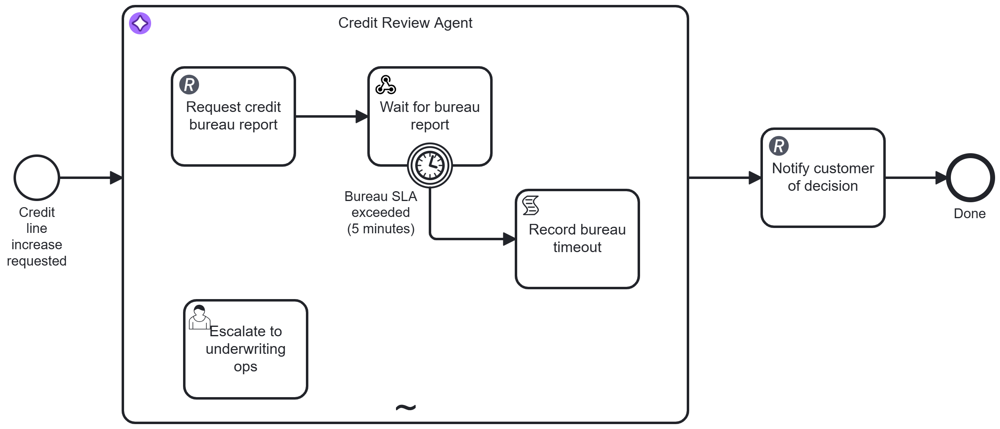

# Credit Line Increase Agent (Long-Running Agent)

[](https://modeler.cloud.camunda.io/import/resources?source=https://raw.githubusercontent.com/camunda/camunda-8-tutorials/main/examples/long-running-agent/models/credit-line-increase-agent.bpmn,https://raw.githubusercontent.com/camunda/camunda-8-tutorials/main/examples/long-running-agent/models/credit-line-request.form,https://raw.githubusercontent.com/camunda/camunda-8-tutorials/main/examples/long-running-agent/models/underwriting-ops-escalation.form&title=Long-Running%20Agent)

A concrete runnable **Long-Running Agent** example based on the pattern at [camunda.com/orchestrate/agents](https://camunda.com/orchestrate/agents/):

> Works across days or weeks: Waits for external replies from bureaus, customers, and counterparties without consuming resources. Resumes with full context when they arrive. Timers, escalations, and multi-team coordination are handled natively by the engine, not custom polling logic.



It contains:

- a genuinely asynchronous wait, not a slow tool call - the agent's first tool submits a no-op request to a credit bureau and then, as the direct continuation of that same tool call, waits for the bureau's reply. In this demo that reply is a `curl` away; in reality it could be hours or days. Either way, Zeebe holds the wait with **no engine resources consumed** - no worker thread, no polling job, nothing to time out and retry
- **one webhook, attached to a wait step instead of a start event** - the wait is resumed by posting the bureau response to a webhook endpoint on `WaitForBureauReport`. In this demo, that webhook call is how you simulate the external answer, so you can wait as long as you want before replying. No separate infrastructure, same zero-friction webhook endpoint mechanism, just attached to a mid-process receive task
- an **SLA timer scoped to exactly one wait**, not the whole agent - the interrupting timer boundary sits directly on the wait task, so only that one tool call times out. Because a boundary event nested inside an ad-hoc subprocess can only route to another node inside that same subprocess, the timeout reports back into the agent's own tool-call loop instead of forcibly ejecting it
- **multi-team coordination as an ordinary tool call, not a hard-coded reroute** - when the bureau misses its SLA, the agent is simply told so and may, entirely its own judgment, call a second tool to ask underwriting ops (a different team) for a manual decision. The engine guarantees the timer fires natively; what happens next is still the agent's call
- one shared final step regardless of path - the agent always finishes with one structured decision, whether it got there from the bureau's reply or from underwriting ops relayed through the agent, so no merge gateway is needed downstream

It is intentionally compact so you can import, run, and leave it waiting for as long as you like.

## Try it in 5 minutes (Camunda 8 SaaS - recommended)

The smoothest path is to use a trial cluster in Camunda SaaS. Just use the following button and install the example into your cluster - you can sign up on the way if you don't yet have one:

[](https://modeler.cloud.camunda.io/import/resources?source=https://raw.githubusercontent.com/camunda/camunda-8-tutorials/main/examples/long-running-agent/models/credit-line-increase-agent.bpmn,https://raw.githubusercontent.com/camunda/camunda-8-tutorials/main/examples/long-running-agent/models/credit-line-request.form,https://raw.githubusercontent.com/camunda/camunda-8-tutorials/main/examples/long-running-agent/models/underwriting-ops-escalation.form&title=Long-Running%20Agent)

Why SaaS first:

- Preconfigured to use the [Camunda-provided LLM](https://docs.camunda.io/docs/components/agentic-orchestration/camunda-provided-llm/), so no access tokens, secrets, or external API keys needed
- The [Webhook connector](https://docs.camunda.io/docs/components/connectors/protocol/http-webhook/) is built in and works the same way on the `Wait for bureau report` task as it does on a start event - deploying the process is enough to get a real, public HTTPS endpoint, with nothing else to install or configure

1. Click the button above to import the process and both forms into Camunda SaaS as one project.
2. Open **credit-line-increase-agent** and click **Deploy and Run**. Its start form opens - the fields already hold a clean scenario; submit as-is, or replace the values with one of the [demo scenarios](#demo-scenarios) below. The form's top note explains the next step - read it once before you submit.
3. Watch Operate: `Credit Review Agent` starts immediately, calls `RequestCreditBureauReport`, and the instance then genuinely parks on `WaitForBureauReport` - no activity, no polling, nothing running.
4. Click the **Wait for bureau report** task (on the process definition in Modeler, not the running instance), open the **Webhooks** tab, and copy its URL. It looks like `https://<region>.connectors.camunda.io/<cluster-id>/inbound/credit-line-bureau-report`. This one URL is reused for every case - it correlates by `customerId`.
5. Send the bureau's reply - use the `customerId` you submitted in step 2:

   ```bash
   curl -X POST "<the webhook URL you copied>" \
     -H "Content-Type: application/json" \
     -d '{
       "customerId": "CUST-70210",
       "creditScoreExternal": 712,
       "existingDebtUSD": 8400,
       "bureauFlags": "none"
     }'
   ```

6. Watch Operate: the agent resumes immediately with full context - as if no time had passed - reasons over the bureau's report, and produces its final decision. `Notify customer of decision` fires and the instance completes.

## Try the SLA timeout (the actual point of this example)

1. Repeat steps 1-3 above with a **new** `customerId` (start a fresh instance).
2. This time, **don't** send the webhook reply. Just wait - the demo SLA is 3 minutes.
3. Watch Operate: the interrupting timer boundary on `WaitForBureauReport` fires on its own, scoped to exactly that one wait step. `Record bureau timeout` reports this back into the agent's tool-call loop.
4. The agent - its own judgment call, not a requirement - will typically call `EscalateToUnderwritingOps` next. An **Escalate to underwriting ops** task appears in Tasklist, prefilled with the application details and the agent's own question. Fill in a decision and submit it.
5. Watch Operate: the agent resumes with the human's decision, produces its own final structured answer based on it, and the instance completes through the same `Notify customer of decision` step as the happy path - no separate ending was needed for the escalated case.

If the agent decides *not* to escalate (it is genuinely allowed to proceed on the application details alone), that's fine too - it will still reach a decision and finish normally.

## What happens technically

`Credit Review Agent` is an ad-hoc subprocess (an AI agent) that runs on every submitted request. Inside it, the model can invoke:

| # | Capability | Protocol | Backing service | Tool / BPMN element |
|---|---|---|---|---|
| 1 | Request the bureau report and wait for it | REST (fire) then webhook-correlated wait task | httpbin.io echo, then an inbound webhook | `RequestCreditBureauReport` -> `WaitForBureauReport` (3-minute SLA timer) |
| 2 | Ask underwriting ops for a manual decision | Human task, agent's own choice | Tasklist, form `underwriting-ops-escalation` | `EscalateToUnderwritingOps` |

**The request-then-wait chain is one tool, not two.** `RequestCreditBureauReport` and `WaitForBureauReport` are connected by a plain sequence flow, so only the first is a callable root node in the ad-hoc subprocess (Camunda resolves tools as the subprocess's root nodes - the ones with no incoming flow). From the model's perspective, calling `RequestCreditBureauReport` is exactly like calling a slow HTTP endpoint: the tool call simply doesn't return until the bureau's webhook lands (or the SLA elapses), however long that takes. `WaitForBureauReport` carries the [HTTP Webhook connector](https://docs.camunda.io/docs/components/connectors/protocol/http-webhook/) configured on a **receive task** rather than a start event. In this demo, that webhook post is the simulated bureau reply, so you can intentionally delay it to emulate minutes, hours, or days of real-world waiting.

**The timer is scoped to the wait, not the whole agent.** The interrupting boundary timer sits directly on `WaitForBureauReport` (demo-scaled to `PT3M`, standing in for a real multi-day SLA). A boundary event attached to an element nested inside an ad-hoc subprocess can only route to another node inside that same subprocess, so its firing can't eject the agent - it can only tell it something. `Record bureau timeout` is that message: a plain script task that sets `toolCallResult` to a short note. The agent reads that note as the return value of its `RequestCreditBureauReport` call and decides what to do next - it is not forced into any particular next step.

**Escalation is a tool call, not a reroute.** `EscalateToUnderwritingOps` is a second, independent root node in the same ad-hoc subprocess - a plain Camunda user task with no structural connection to the timeout at all. The agent calls it (or doesn't) purely on its own judgment. The prefilled Tasklist form shows the application facts plus the agent's own question and summary (via `fromAi()` parameters), and the human's answer comes back as this tool's plain-text result.

There is no "record the decision" tool call and no merge gateway after the subprocess. The AI Agent connector's own response format is set to `json` with a schema (`decisionOutcome`: enum `approved`/`reduced`/`denied`, `approvedLimitUSD`: number, `decisionSummary`: string) - once the agent stops calling tools and gives its final answer, that answer *is* structured data, whether it was reached via the bureau's reply or via underwriting ops' decision relayed back through the agent. Both paths converge on the same `Notify customer of decision` step.

## Demo scenarios

Every scenario starts with the form, then a `curl` to the `WaitForBureauReport` webhook URL using the same `customerId`.

### Approved as requested

Bureau report:

```json
{ "customerId": "CUST-70210", "creditScoreExternal": 745, "existingDebtUSD": 4000, "bureauFlags": "none" }
```

A strong score, low debt relative to the requested limit, and no late payments on file clears every "approve as requested" threshold.

### Approved at a reduced limit

Bureau report:

```json
{ "customerId": "CUST-70211", "creditScoreExternal": 655, "existingDebtUSD": 9000, "bureauFlags": "minor - one missed utility payment" }
```

A middling score with a minor flag lands the agent on a reduced-limit approval, roughly halfway between the current and requested limit.

### Denied

Bureau report:

```json
{ "customerId": "CUST-70212", "creditScoreExternal": 560, "existingDebtUSD": 15000, "bureauFlags": "delinquent account on file" }
```

A weak score and a delinquency flag are clear denial territory.

### SLA timeout and human escalation (see [above](#try-the-sla-timeout-the-actual-point-of-this-example))

Don't send a bureau reply at all - let the 3-minute demo SLA elapse and watch the agent decide, on its own, whether to bring in underwriting ops.

## Local/self-managed path (advanced)

Use this only if you need local Docker-based setup with your own LLM. The webhook mechanics work the same way, but you'll need to construct the URL yourself (no **Webhooks** tab in Desktop Modeler):

`http(s)://<connectors base URL>/inbound/credit-line-bureau-report` - see the [HTTP Webhook connector docs](https://docs.camunda.io/docs/components/connectors/protocol/http-webhook/#activate-the-http-webhook-connector-by-deploying-your-diagram) for the exact base URL for your setup.

1. [Install a local LLM](https://docs.camunda.io/docs/next/guides/getting-started-agentic-orchestration/#set-up-ollama) (or use hosted credentials).
2. Configure environment variables (example for local Ollama):

```env
SECRET_CAMUNDA_PROVIDED_LLM_API_ENDPOINT=http://localhost:11434/v1
SECRET_CAMUNDA_PROVIDED_LLM_API_KEY=null
SECRET_CAMUNDA_PROVIDED_LLM_DEFAULT_MODEL=gpt-oss:20b
```

3. Start [Camunda 8 Run](https://docs.camunda.io/docs/self-managed/quickstart/developer-quickstart/c8run/).
4. Deploy [models/credit-line-increase-agent.bpmn](models/credit-line-increase-agent.bpmn), [models/credit-line-request.form](models/credit-line-request.form), and [models/underwriting-ops-escalation.form](models/underwriting-ops-escalation.form).
5. Trigger it via the start form, then send the same `curl` commands shown above against your own webhook base URL.

Camunda secrets read `secrets.<NAME>` from same-named environment variables.

## Notes and disclaimer

This is an illustrative demo only, deliberately simplified to make the long-running mechanics legible in a few minutes.

- **Real credit underwriting is a lot more complex than this.** Production systems pull from multiple bureaus, weigh far more signals, and involve regulatory disclosures this example doesn't attempt to model. The point here is to show *how* Camunda models a long-running agent - a genuinely async wait with no polling, a timer scoped to exactly the step that needs it, and agent-driven multi-team coordination - not to prescribe how credit decisions should actually be made.
- httpbin.io is a stand-in for a real credit bureau's intake API. The bureau's *reply* is simulated entirely by your own `curl` call - there is no real bureau integration here.
- The 3-minute SLA exists purely so the timeout and escalation demo is reproducible in a live walkthrough - a real bureau SLA would likely be measured in hours or days, which is exactly the point: nothing about this pattern changes if you make that duration much longer, because the wait consumes no engine resources either way.
- No real customer or credit data is used.
- Nothing here should be interpreted as credit-underwriting or compliance guidance.

Please be respectful of shared public services (httpbin.io). This example is intentionally low-volume and not intended for load testing.
