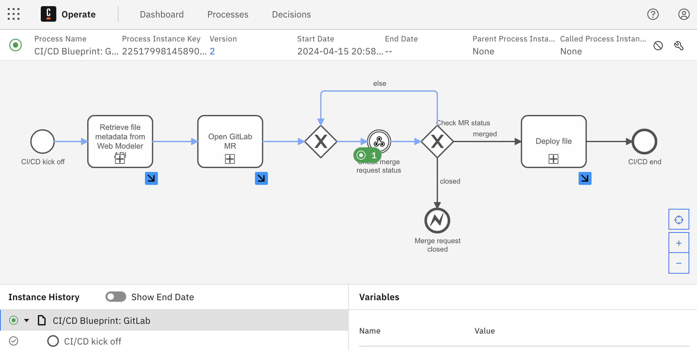
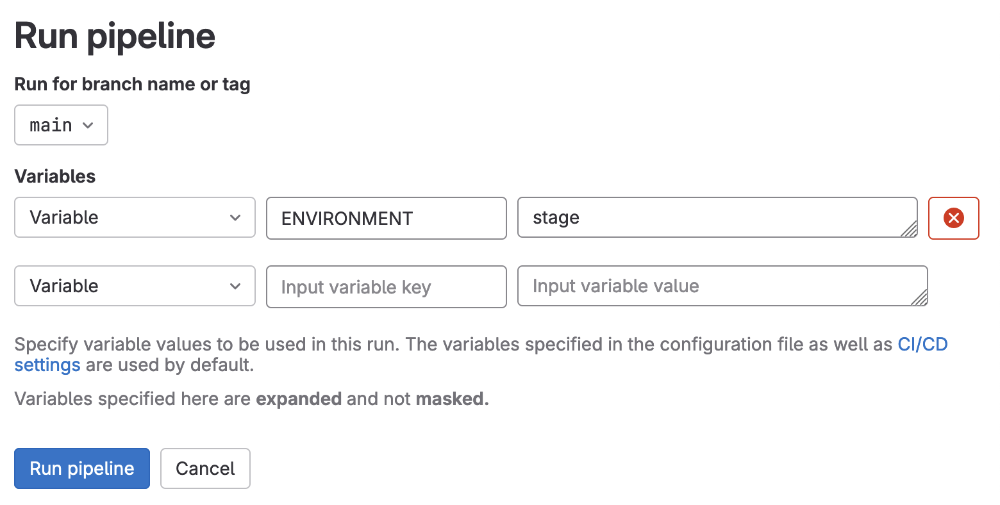

# CI/CD Pipeline
**Technical level:** Complex
 
**Industry:** Any
 
**Use Cases:** Modeler Building Blocks

## Summary

This blueprint demonstrates a CI/CD pipeline for deploying a file to different environments using GitLab and Camunda Platform 8.
During the process, a pull request is created in the target repository, which, when merged, triggers the deployment to the development environment.
For deploying to the stage and production environments, custom pipeline runs have to be triggered.

## How to use

### Set up Camunda 8 cluster

#### SaaS

1. In [Console](https://console.cloud.camunda.io), navigate to the "Organization" > "Administration API".
2. Click on "Create new credentials" and check the "Web Modeler API" box (this should automatically check at least "Get" and "Create" below "Web Modeler API").
3. Click on "Create" and create a connector secret `WEB_MODELER_CLIENT_ID` and `WEB_MODELER_CLIENT_SECRET` in the cluster you want to use the blueprint in and set the values to the "Client ID" and "Client Secret" respectively.

#### Self-Managed

1. Create an M2M application for the Web Modeler API [as described in the documentation](https://docs.camunda.io/docs/apis-tools/web-modeler-api/authentication/) with at least `create:*` and `read:*` permissions.
2. [Follow the documentation](https://docs.camunda.io/docs/self-managed/connectors-deployment/connectors-configuration/#secrets) to create the connector secrets `WEB_MODELER_CLIENT_ID` and `WEB_MODELER_CLIENT_SECRET` in the cluster you want to use the blueprint in and set the values to the "Client ID" and "Client Secret" respectively.

### Set up the CI/CD blueprint in Web Modeler

1. Import [the blueprint diagram](./CI-CD%20Pipeline.bpmn) into a Web Modeler project.
2. Navigate to the start event and open check the "Public access enabled" box in the properties panel in the "Publication" section.
3. Deploy the diagram to the target Camunda 8 cluster.

### Configure the target GitLab repository

#### Set up webhook
1. Within the blueprint's diagram, navigate to the "Check pull request status" task, open the "Webhook" tab in the properties panel, and copy the Webhook path.
2. Create a new GitLab repository/navigate to the repository you want to use as target for your CI/CD pipeline.
3. In the repository settings, navigate to the Webhooks section and click on "Add new webhook".
    1. Set URL to the one you copied in step 1.
    2. Assign a secret token to the webhook.
    3. In the section "Trigger", select "Merge request events".

Repeat the steps for all Webhook Intermediate Catch Event Connectors within the "Deploy file" subprocess.

> [!IMPORTANT]
> By default, the same secret is used for all connectors.
> If you want to use different secrets, you have to adjust the blueprint accordingly.

After setting up the GitLab repository, create a new connector secret `GITLAB_WEBHOOK_SECRET` in the cluster you want to use the blueprint in and set the value to the secret you assigned to the GitLab webhook.

#### Set up deployment pipeline

1. Copy the pipeline from the [`gitlab-pipeline`](./gitlab-pipeline/.gitlab-ci.yml) directory to your target repository root.
2. Within the repository settings, navigate to "CI/CD > Variables" and add the following variables to the target repository:

##### Development Environment

| Variable name                    | Description                                                                                                                                         |
|----------------------------------|-----------------------------------------------------------------------------------------------------------------------------------------------------|
| `DEV_ZEEBE_ADDRESS`              | The address of the production Zeebe cluster, e.g. `3edeb612-7423-4683-b85b-095f9b90ab64.bru-2.zeebe.camunda.io:443`                                 |
| `DEV_ZEEBE_CLIENT_ID`            | The ID of the Zeebe client used for deploying the diagram to the development environment.                                                           |
| `DEV_ZEEBE_CLIENT_SECRET`        | The ID of the Zeebe client used for deploying the diagram to the development environment.                                                           |
| `DEV_WEB_MODELER_WEBHOOK_URL`    | The URL of the webhook reporting back to the blueprint.                                                                                             |
| `DEV_WEB_MODELER_WEBHOOK_SECRET` | The secret you want to use for the webhook reporting back to the blueprint. Defaults to use the same secret as configured [above](#Set-up-webhook). |

##### Stage Environment

| Variable name                      | Description                                                                                                                                         |
|------------------------------------|-----------------------------------------------------------------------------------------------------------------------------------------------------|
| `STAGE_ZEEBE_ADDRESS`              | The address of the production Zeebe cluster, e.g. `3edeb612-7423-4683-b85b-095f9b90ab64.bru-2.zeebe.camunda.io:443`                                 |
| `STAGE_ZEEBE_CLIENT_ID`            | The ID of the Zeebe client used for deploying the diagram to the staging environment.                                                               |
| `STAGE_ZEEBE_CLIENT_SECRET`        | The ID of the Zeebe client used for deploying the diagram to the staging environment.                                                               |
| `STAGE_WEB_MODELER_WEBHOOK_URL`    | The URL of the webhook reporting back to the blueprint.                                                                                             |
| `STAGE_WEB_MODELER_WEBHOOK_SECRET` | The secret you want to use for the webhook reporting back to the blueprint. Defaults to use the same secret as configured [above](#Set-up-webhook). |

##### Production Environment

| Variable name                     | Description                                                                                                                                         |
|-----------------------------------|-----------------------------------------------------------------------------------------------------------------------------------------------------|
| `PROD_ZEEBE_ADDRESS`              | The address of the production Zeebe cluster, e.g. `3edeb612-7423-4683-b85b-095f9b90ab64.bru-2.zeebe.camunda.io:443`                                 |
| `PROD_ZEEBE_CLIENT_ID`            | The ID of the Zeebe client used for deploying the diagram to the production environment.                                                            |
| `PROD_ZEEBE_CLIENT_SECRET`        | The ID of the Zeebe client used for deploying the diagram to the production environment.                                                            |
| `PROD_WEB_MODELER_WEBHOOK_URL`    | The URL of the webhook reporting back to the blueprint.                                                                                             |
| `PROD_WEB_MODELER_WEBHOOK_SECRET` | The secret you want to use for the webhook reporting back to the blueprint. Defaults to use the same secret as configured [above](#Set-up-webhook). |

### Generate an access token

1. Navigate to "Settings > Access Tokens" and create a new token for the repository you want to use the blueprint in:
    * Scopes: `api`, `write_repository`
    * Roles: `Developer`
2. Save the token as a new connector secret `GITLAB_PAT` within your cluster.

### Run the blueprint

You can either [start the blueprint via Camunda Tasklist](https://docs.camunda.io/docs/next/components/modeler/web-modeler/run-or-publish-your-process/#publish-to-tasklist) or via running it [directly in Web Modeler](https://docs.camunda.io/docs/next/components/modeler/web-modeler/run-or-publish-your-process/#run-manually-from-modeler).
Additionally, on Camunda 8 SaaS, you can use[ the public link of the blueprint's start event](https://docs.camunda.io/docs/next/components/modeler/web-modeler/run-or-publish-your-process/#publish-via-a-public-form) to start a new instance of the blueprint.

After starting a process instance, it will create a pull request with the contents of the target folder in the target repository.
When you merge the pull request, the folder contents will be deployed to the development environment via [the `deploy_to_dev` job within the pipeline](./gitlab-pipeline/.gitlab-ci.yml).
To check the status of the process, you can always use [Camunda Operate](https://docs.camunda.io/docs/next/components/operate/operate-introduction/) to have a look at the status of the process.
Operate should indicate with blue colored sequence flows the where to process went and mark the current activity with a green circle:

For deploying to the stage environment, create a custom pipeline run via "Build > Pipelines > Run pipeline" and additionally pass a variable `ENVIRONMENT` with the value `stage` to the pipeline run:

For deploying to the production environment, pass a variable `ENVIRONMENT` with the value `prod` to the pipeline run.

## Known Limitations

* Concurrent runs of the blueprint are not supported. This means that if you start the blueprint while another instance is still running, deployment information might be mixed between the two instances.
* Changes to the created branch are not tracked. This means that if you change the content of a synced file within the git repository, the blueprint will not update the file content within Web Modeler.
