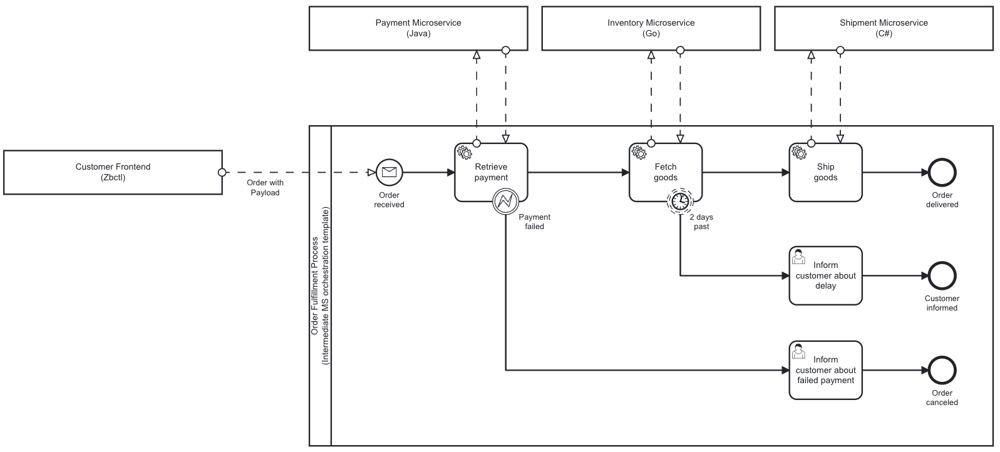
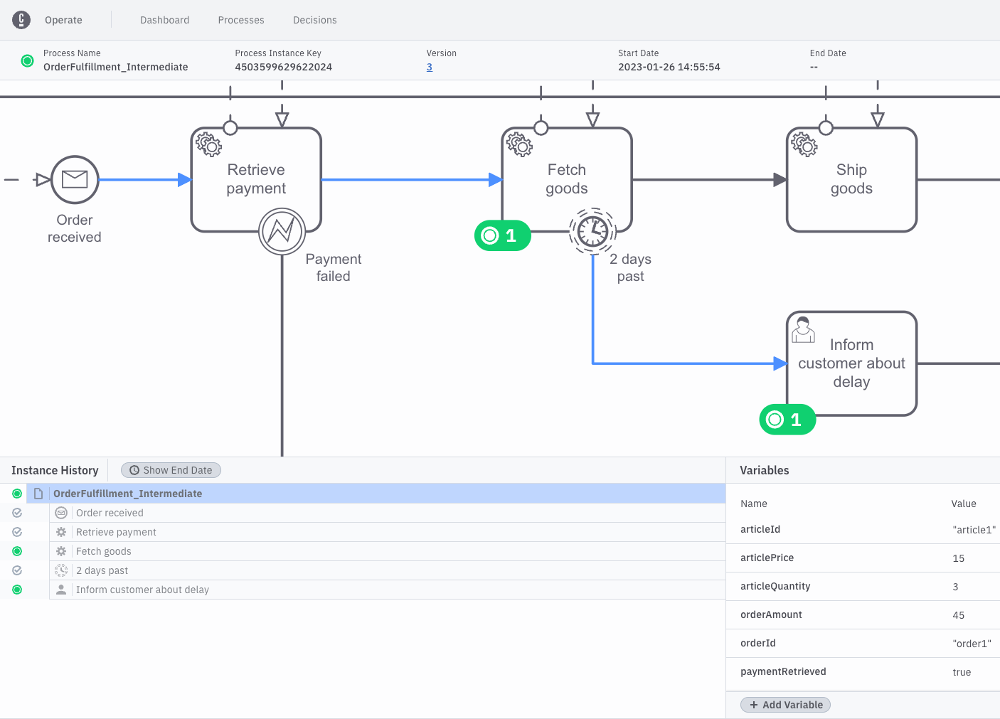
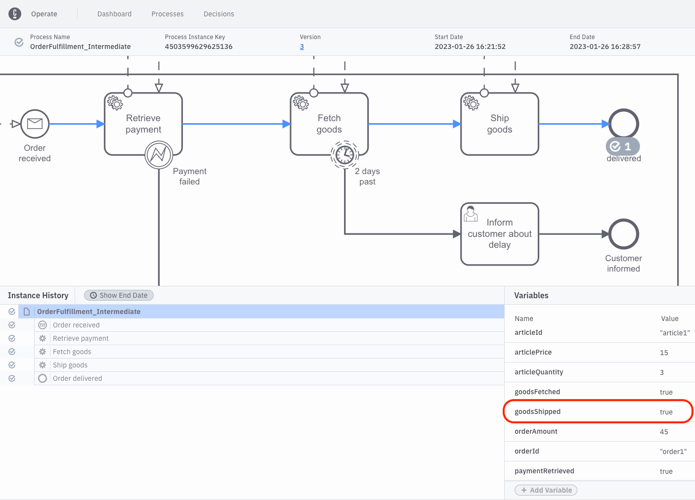

# Intermediate Microservice Orchestration Process template

This Repository hosts the implementation of the intermediate Microservice Orchestration template which is provided within [Camunda Platform 8](https://accounts.cloud.camunda.io/signup)



## How to deploy the process

There are several ways how the template could be deployed to your Camunda Platform 8 Cluster.

### Via the process templates catalog available in Camunda Web Modeler (as part of Camunda Platform 8 SaaS) (= Deployment via Web browser)

The easiest option to deploy the process template is by doing so via the process template picker available in Camunda Platform 8. Follow this [documentation](https://docs.camunda.io/docs/next/components/modeler/web-modeler/launch-cloud-modeler/) and choose the option to "Create model from template"
 
### Via zbctl (= Deployment via Terminal / Command line)

zbctl is the command line interface to interact with Camunda Platform 8. It offers to deploy resources to a Camunda Platform 8 Cluster. Follow the [installation documentation](https://docs.camunda.io/docs/next/apis-clients/cli-client/) to properly set it up and connect it to your Cluster.

Then deploy the BPMN file via:

```
zbctl deploy order-fulfillment-process.bpmn
```

### Via Camunda Desktop Modeler (= Deployment via Desktop application)

- [Install](https://docs.camunda.io/docs/next/components/modeler/desktop-modeler/install-the-modeler/) the Desktop Modeler

- Open the process diagram with the Desktop Modeler

- Follow our [deployment guide](https://docs.camunda.io/docs/next/components/modeler/desktop-modeler/connect-to-camunda-cloud/).

## How to start a process

Typically, an order fulfillment process like the one at hand would be started by a customer that places an order via some kind of user interface. For example this could be a website (like an online shop), that serves as the frontend for a backend application which then utilizes Camunda as a process orchestrator.

In this example, we are going without having such a frontend at hand and use the zbctl CLI instead. In general, zbctl is the command line interface to interact with Camunda Platform 8 that allows users to create and read resources of all kinds inside the Zeebe broker that executes the process. One function zbctl offers is to publish messages inside the Zeebe cluster. This is a great feature that helps us to get quickly started and this way being able to mock the user frontend mentioned above.

To start a process instance via the message start event "Order received", use the following zbctl command

```
zbctl publish message Msg_OrderReceived --correlationKey "order1" --variables "{\"orderId\": \"order1\",\"articleId\": \"article1\", \"articleQuantity\": 3, \"articlePrice\": 15}"
```

This publishes the message labeled with "Order received" in our model with the message name "Msg_OrderReceived". To specify the payload, in our case the articles and their quantities, we can make use of the --variables-flag.

The correlationKey-flag allows us to tell Zeebe for which order an instance should be created.

Hint: Make sure to adjust the --correlationKey parameter when you want to have more than one order process instance at the same time. As long as the above created "order1" process instance is not completed and still actively running, no new order process instance will be created when you use the "order1" correlation key again. Have a look at [start message documentation](https://docs.camunda.io/docs/next/components/modeler/bpmn/message-events/#message-start-events) for more details on the intended behaviour here.

Once the message was successfully published, you should see something similiar in your console:

```bash
{
  "key": "4503599627731585"
}
```

The [response](https://docs.camunda.io/docs/next/apis-clients/grpc/#output-publishmessageresponse) shows you the unique id of the message that was published.

You can use [Camunda Operate](https://docs.camunda.io/docs/next/components/operate/operate-introduction/) to have a look at the status of the process. Operate should indicate with a green label at the "Retrieve payment task" marked with "1" that there is one process instance waiting for the "Retrieve payment" task to be completed.

See the following screenshot:


Congratulations! 🎉 You just started your first process instance of the order fulfillment process. 
Let's complete some process tasks now.


### Bonus:

If you are interested in developing a custom frontend to start the process instead of using zbctl, have a look at these resources:

- [Starter example](https://github.com/camunda-community-hub/camunda-8-examples/tree/main/start-form-springboot) how to use [Camunda Forms](https://docs.camunda.io/docs/next/components/modeler/forms/camunda-forms-reference/) within a simple HTML page to start a process


## How to use the workers

## Retrieve Payment worker (Java)

Configure your Camunda Platform 8 connection. This can be done by enriching the following file with your individual environment details:

`src/main/resources/application.properties`:

### Camunda Platform 8 SaaS (hosted by Camunda)

Connections to the Camunda SaaS can be easily configured, create the following entries in your properties file:

```properties
zeebe.client.cloud.cluster-id=xxx
zeebe.client.cloud.client-id=xxx
zeebe.client.cloud.client-secret=xxx
zeebe.client.cloud.region=bru-2
```

### Camunda Platform 8 Self-Managed (hosted by yourself)

You can also configure the connection to a self-managed Zeebe broker:

```properties
zeebe.client.broker.gateway-address=127.0.0.1:26500
zeebe.client.security.plaintext=true
```

Run the application via
```
./mvnw spring-boot:run
```

The worker should log something along the words once it succesfully started, activated the job for the "Retrieve payment" task and then completed the job:

```bash
io.camunda.zeebe.client.job.poller       : Activated 1 jobs for worker exampleJobWorkers#retrievePayment and job type retrievePayment
io.camunda.zeebe.client.job.poller       : Activated 1 jobs for worker exampleJobWorkers#retrievePayment and job type retrievePayment
i.c.z.spring.example.ExampleJobWorkers   : complete job
>>> [type: retrievePayment, key: 4503599627727722, element: Activity_RetrievePayment, workflow instance: 4503599627727709]
[variable parameter: Order{orderId='order1', articleId='article1', articleQuantity=3, articlePrice=15}
```

Again, you can use [Camunda Operate](https://docs.camunda.io/docs/next/components/operate/operate-introduction/) to have a look at the status of the process. Operate should indicate with blue colored sequence flows the where to process went. The "Retrieve payment" task should be completed and a green label marked with "1" at the "Fetch goods" task should indicate that there is one process instance waiting for the "Fetch goods" task to be completed. Additionally, in the "Variables" section below on the right side you should now find a variable called "paymentRetrieved" which should have been set to "true" by the "Retrieve payment" worker.

See the following screenshot:


Congratulations! 🎉 
You just completed your first servcie task of the order fulfillment process via a Java microservice. 
Let's complete the remaining process tasks with the help of other microservices available.

### Bonus: Java job workers for "Fetch goods" and "Ship goods"

There are two more job workers defined, but disabled. They could be activated and used to complete the whole order fulfilment process via Java workers.
In order to activate them, just enable them by setting the respective Job worker annotation to true:

```
@JobWorker(enabled = true)
```

### How to write own Java job workers

The Java job workers in this template were created with the [Spring Zeebe Client](https://github.com/camunda-community-hub/spring-zeebe/). Spring Zeebe is a wrapper around the [Zeebe Java Client](https://docs.camunda.io/docs/apis-clients/java-client/). Have a look at the [Spring Zeebe readme and examples](https://github.com/camunda-community-hub/spring-zeebe/) to learn what Spring Zeebe offers to write own Java job workers.

### Bonus: How the let the worker fail (i.e. how to throw the BPMN error)

In order to simulate that something failed with the payment while trying to retrieve the payment, we need the Java job worker for the "Retrieve payment" task to throw a BPMN error.

Therefore you can set a flag when starting a process instance. Just set a variable `paymentShouldFail` with the value `true`.

The corresponding zbctl command would then be:

```
zbctl publish message Msg_OrderReceived --correlationKey "1" --variables "{\"orderId\": \"order1\",\"articleId\": \"article1\", \"articleQuantity\": 3, \"articlePrice\": 15, \"paymentShouldFail\":true}"
```

This way to worker will eventually throw and trigger the "Payment failed" BPMN Error via 

```Java
throw new ZeebeBpmnError("paymentFailed", "The payment failed due to an error");
```

which leads to the user task "Inform customer about failed payment"

[Camunda Tasklist](https://docs.camunda.io/docs/next/components/tasklist/introduction-to-tasklist/) can be used to work on this user task.

## Fetch Goods worker (Go)

Set the connection settings and client credentials as environment variables:

```bash
export ZEEBE_ADDRESS='[Zeebe API]'
export ZEEBE_CLIENT_ID='[Client ID]'
export ZEEBE_CLIENT_SECRET='[Client Secret]'
export ZEEBE_AUTHORIZATION_SERVER_URL='[OAuth API]'
```

Run the worker via

```bash
go run fetch-goods-worker.go
```

Again, you can use [Camunda Operate](https://docs.camunda.io/docs/next/components/operate/operate-introduction/) to have a look at the status of the process. Operate should indicate with blue colored sequence flows the where to process went. The "Fetch goods" task should be completed and a green label marked with "1" at the "Ship goods" task should indicate that there is one process instance waiting for the "Ship goods" task to be completed. Additionally, in the "Variables" section below on the right side you should now find a variable called "goodsFetched" which should have been set to "true" by the "Fetch goods" worker.

See the following screenshot:


Congratulations! 🎉 
You just completed your second servcie task of the order fulfillment process via a Go microservice. 
Let's complete the remaining process task with the help of other microservices available.

### How to write own Go job workers

The Go job worker in this template was created with the [Go Client](https://docs.camunda.io/docs/next/apis-clients/go-client/). 

Have a look at the [Getting started with the Go client](https://docs.camunda.io/docs/next/apis-clients/go-client/go-get-started/) tutorial to learn how to use and write own Go job workers with it.

### How to time-out the "Fetch goods" task (i.e. make use of the attached timer event)

Even though the label in the process model says "2 days past", the technical attribute behind the [non-interrupting attached boundary event](https://docs.camunda.io/docs/next/components/modeler/bpmn/timer-events/#timer-boundary-events) is only set to 5 minutes (=PT5M), in order to be able to easily simulate the timeout of the task.

So in order to simulate it, you don`t need to do something actively but just wait for 5 minutes.

Learn more about setting [timer durations](https://docs.camunda.io/docs/next/components/modeler/bpmn/timer-events/#time-duration)

The correct timer duration for a 2 day timer would be `PT2D`.

After the timer was fired, the process still waits for the completion of the "Fetch goods" task and addtionally creates the user task "Inform customer about delay"

See the following screenshot:



[Camunda Tasklist](https://docs.camunda.io/docs/next/components/tasklist/introduction-to-tasklist/) can be used to work on this user task.

## Ship Goods worker

Configure your connection to the Camunda 8 Platform cluster directly within the "ship-goods-worker.cs" file.

```c#
private static readonly String _ClientID = "xxx";
private static readonly String _ClientSecret = "xxx";
private static readonly String _ContactPoint = "xxx"; // = ZEEBE_ADDRESS
private static readonly String _JobType = "shipGoods"; 
```

Run the worker via

```bash
dotnet run ship-goods-worker.cs
```

Again, you can use [Camunda Operate](https://docs.camunda.io/docs/next/components/operate/operate-introduction/) to have a look at the status of the process. Operate should indicate with blue colored sequence flows the where to process went. The "Ship goods" task should be completed and a grey label marked with a checkmark and "1" at the end event "Order delivered" should indicate that the process instance was completed. Additionally, in the "Variables" section below on the right side you should now find a variable called "goodsShipped" which should have been set to "true" by the "Ship goods" worker.

See the following screenshot:



Congratulations! 🎉 
You just completed your third servcie task of the order fulfillment process via a .NET microservice written in C#. 

### How to write own .NET job workers

The C# .NET job worker in this template was created with the [C# Community Client](https://docs.camunda.io/docs/next/apis-clients/community-clients/c-sharp/). 


### Whats next

Congratulations! 🎉 You just completed your first process instance of the order fulfillment process by orchestrating different microservices.

Let's have a look at more advanced process templates waiting for you in the process templates catalog available in Camunda Web Modeler (as part of [Camunda Platform 8 SaaS](https://accounts.cloud.camunda.io/signup))